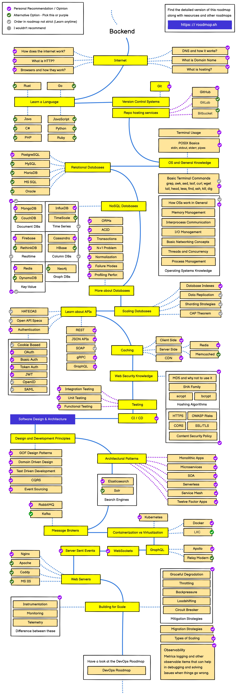

# BackEnd Roadmap Study

## What is this?

BackEnd Roadmap Study is my repository and notebook from all my studies as a BackEnd Developer.

## Summary

[01. Internet](01_Internet/README.md)
 
[02. Basic Frontend](02_Basic_Frontend/README.md)
 
[03. OS and General](03_OS_and_General/README.md)
 
[04. Languages](04_Languages/README.md)
 
[05. GIT](05_GIT/README.md)
 
[06. Databases](06_Databases/README.md)
 
[07. More About Databases](07_More_About_Databases/README.md)
 
[08. APIs](08_APIs/README.md)
 
[09. Caching](09_Caching/README.md)
 
[10. Web Security](10_Web_Security/README.md)
 
[11. Testing](11_Testing/README.md)
 
[12. CI/CD](12_CI_CD/README.md)
 
[13. Design and Development Principles](13_Design_and_Development_Principles/README.md)
 
[14. Search Engines](14_Search_Engines/README.md)
 
[15. Message Brokers](15_Message_Brokers/README.md)
 
[16. Containerization vs Virtualization](16_Containerization_vs_Virtualization/README.md)
 
[17. GraphQL](17_GraphQL/README.md)
 
[18. Graph Databases](18_Graph_Databases/README.md)
 
[19. Websockets](19_Websockets/README.md)
 
[20. Web Servers](20_Web_Servers/README.md)
 
[21. Building for Scale](21_Building_for_Scale/README.md)
 
[22. Frameworks](22_Frameworks/README.md)
 

## Backend Roadmap Diagram

## Author

<h5>Thank you very much for reading so far. I'm open for everything, and I really hope to see you next time. Best Regards, Braian.</h5>

👤 **Braian Mendes**

* Twitter: [@'braian_dev'](https://twitter.com/braian_dev)
* Github: [@BraianMendes](https://github.com/BraianMendes)
* LinkedIn: [@braianmendes](https://linkedin.com/in/braianmendes)

## Show your support

Give a ⭐️ if this project helped you!

